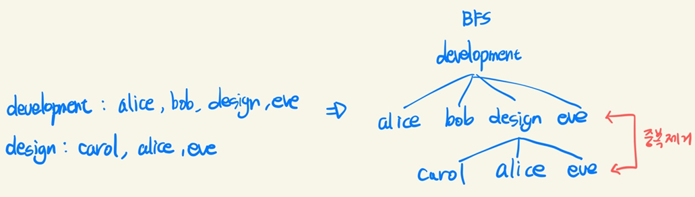

# 백준 3865 학회원

[백준 3865 - 학회원](https://www.acmicpc.net/problem/3865)  
  

### 풀이 과정  

루트노드로 첫 번째 학회를 두고 넓이 우선 탐색 하면서 멤버를 리스트에 추가함.

최종 결과에서 중복 제거 중요.

(중복 제거 할려고 딕셔너리 value를 set으로 하니까 데이터 추가가 안 되던데.. 아시는 분?)




### 소스 코드

```py
from collections import deque

while True:

    # INPUT
    n = int(input())
    if n == 0: 
        break

    dic = {}
    for _ in range(n):
        society, members = input().split(':')
        dic[society] = members[:-1].split(',')


    # Solution
    first = list(dic.keys())[0]
    q = deque([first])

    while q:
        cur = q.popleft()

        for member in dic[cur]:
            if member in dic:               # member이름이 society이면
                for i in dic[member]:       # 첫 번째 학회원 리스트에 추가
                    if i not in dic[first]:
                        dic[first].append(i)


    # OUTPUT
    answer = 0
    for i in set(dic[first]):
        if i not in dic:
            answer += 1

    print(answer)
```