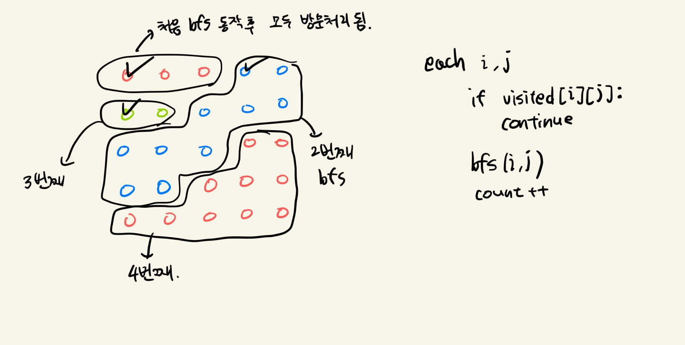

# 백준 10226 적록색약

[백준 10226 - 적록색약](https://www.acmicpc.net/problem/10026)  
  

### 풀이 과정  

2차원 그래프 BFS로 접근

1. 방문 표시를 할 것.
2. 모든 노드별로 bfs를 돌려야 함.
    - 이미 방문했던 노드라면 pass


탐색 로직
   - 시작점 기준으로 탐색하는데 만약 처음 시작한 노드의 값이랑 다르다면 해당 노드는 탐색하지 않는다.

여기서 노드의 값은 R, G, B가 됨.

그리고 최종적으로 bfs함수 호출 횟수를 카운트해주면 된다.

정상인일 때는 이렇게 하면되고, 색맹일 때는 그래프의 `R` 값을 `G`로 다 바꿔주고 똑같이 하면 된다.




### 소스 코드

```py
from collections import deque

n = int(input())
graph = [list(map(str, input())) for _ in range(n)]

dx = [0, 0, -1, 1]
dy = [-1, 1, 0, 0]

def bfs(sx, sy):
    global visited

    q = deque([[sx, sy]])
    while q:
        cx, cy = q.popleft()

        for i in range(4):
            nx = cx + dx[i]
            ny = cy + dy[i]

            if not(0 <= nx < n and 0 <= ny < n):
                continue
            if graph[nx][ny] != graph[cx][cy] or visited[nx][ny]:
                continue

            visited[nx][ny] = True
            q.append([nx, ny])


answer = [0, 0]

# 색맹 아닌 사람
visited = [[False]*n for _ in range(n)]
for i in range(n):
    for j in range(n):
        if visited[i][j]:
            continue
        bfs(i, j)
        answer[0] += 1

# 색맹인 사람
visited = [[False]*n for _ in range(n)]
for i in range(n):
    for j in range(n):
        if graph[i][j] == 'R':
            graph[i][j] = 'G'

for i in range(n):
    for j in range(n):
        if visited[i][j]:
            continue
        bfs(i, j)
        answer[1] += 1


print(" ".join(map(str, answer)))
```