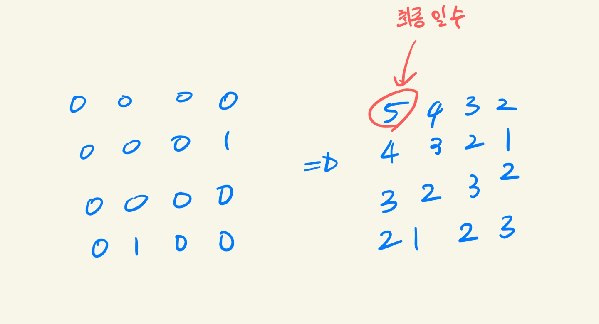

# 백준 7569 토마토

[백준 7569 - 토마토](https://www.acmicpc.net/problem/7569)  
  

### 풀이 과정  

3차원으로 주어진 문제이므로 3차원 리스트의 **BFS**로 접근


1. 초기 토마토의 위치를 **완전탐색**을 통해 토마토의 좌표를 **큐**에 넣고 시작한다.

2. 큐에서 **좌표**를 빼내어 해당 좌표가 익은 토마토인지 아닌지 확인. (graph[z][x][y] == 0)

3. 익은 토마토면 넘어가고 안 익은 토마토면 익은 걸로 바꿔주는데 이전의 숫자에 + 1을 해준다. (graph[nz][nx][ny] = graph[z][x][y] + 1)

    - 해당 카운트가 루프가 종료된 뒤에 지나간 일수가 됨.

4. 모든 루프가 종료된 후 다시한번 그래프를 완전탐색하여 안 익은 토마토가 있으면 -1 리턴.

5. 아니면 마지막으로 채워진 좌표 값 리턴




### 소스 코드

```py
from collections import deque

m, n, h = map(int, input().split())
graph = []

for _ in range(h):
    layer = [list(map(int, input().split())) for _ in range(n)]
    graph.append(layer)
    
dx = [0, 0, -1, 1]
dy = [-1, 1, 0, 0]
dz = [-1, 1]

def bfs():
    q = deque()

    # 초기 토마토의 위치를 찾아 큐에 삽입
    for i in range(h):
        for j in range(n):
            for k in range(m):
                if graph[i][j][k] == 1:
                    q.append([k, j, i])

    result = 0
    while q:
        x, y, z = q.popleft()

        # 위, 아래
        for i in range(2):
            nz = z + dz[i]

            if 0 <= nz < h and graph[nz][y][x] == 0:
                graph[nz][y][x] = graph[z][y][x] + 1
                q.append([x, y, nz])

        # 상, 하, 좌, 우
        for i in range(4):
            nx = x + dx[i]
            ny = y + dy[i]

            if 0 <= nx < m and 0 <= ny < n and graph[z][ny][nx] == 0:
                graph[z][ny][nx] = graph[z][y][x] + 1
                q.append([nx, ny, z])
        
        result = graph[z][y][x]
    
    # 모든 확산이 끝난 뒤 검사
    for i in range(h):
        for j in range(n):
            for k in range(m):
                if graph[i][j][k] == 0:
                    return -1
    
    return result-1
   
print(bfs())
```